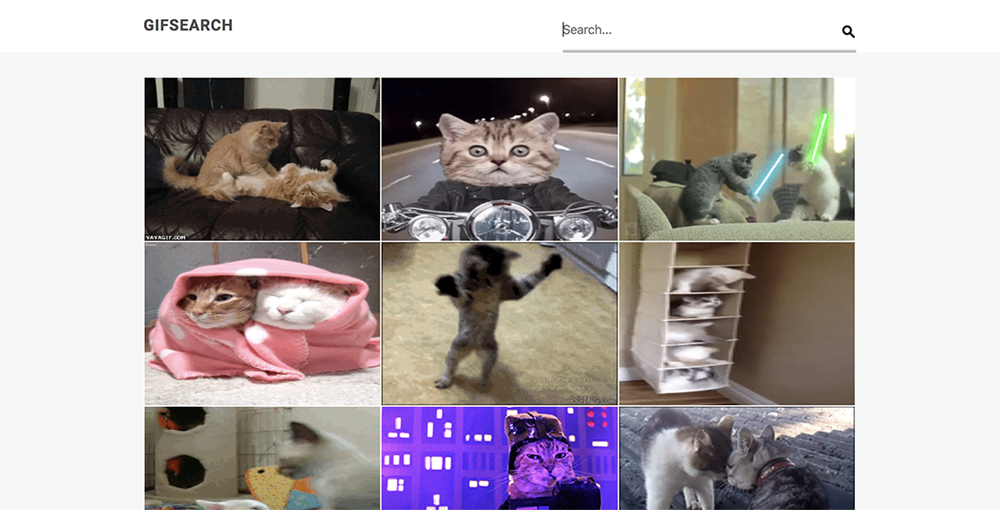

# GIFs Search App with React
Practice fetching external data to display

* Create presentational components
* Search form component
* Error message if search input doesn't exist
* Loading message for client if fetching is loading

## Technologies

* JavaScript
* ReactJS
* CSS

<kbd></kbd>

## Checkout the GIFs Search App
http://earthy-beggar.surge.sh/

Type in what GIFs you want to search for in the input field, whether its cats, dogs, woot, etc.